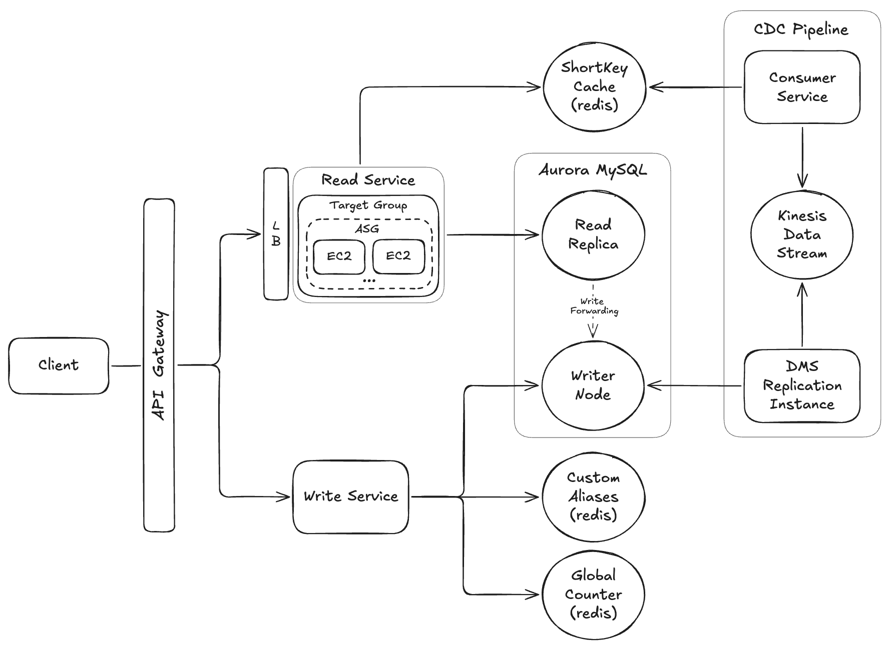
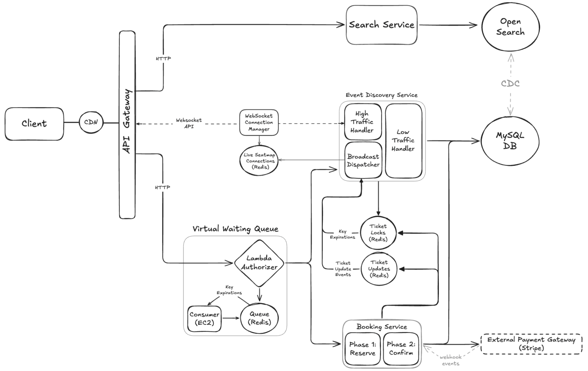
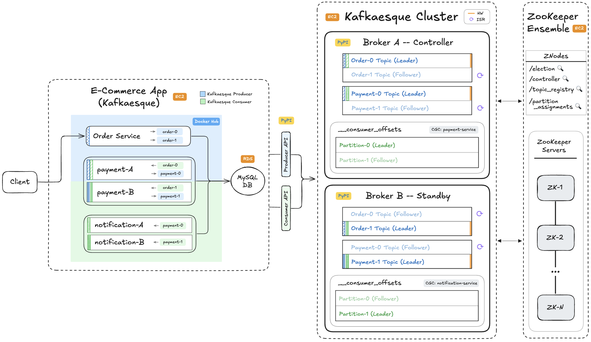

# 🚀 Practical System Design Course

Welcome to the official repository hub for the Udemy course. This course teaches real-world system design by building production-inspired systems from scratch.

**How This Course Is Different**

- Hands-on implementation, not just theory
- Build real systems using AWS, Redis, APIs, Docker, Terraform, and other production-ready tools
- Learn scaling tradeoffs and architecture decisions
- Understand both functional + non-functional requirements in practice

**Who This Course Is For**

- Engineers leveling up backend/system design skills
- Developers preparing for interviews
- Hands-on learners who prefer building over theory
- Curious minds who want to understand large-scale systems

👉 **[Enroll on Udemy](https://www.udemy.com/course/practical-system-design/?referralCode=C5D2686224FFF84F29D3)**

 

---

## 1️⃣ URL Shortener Clone

Build a URL shortener from the ground up, starting with core read/write functionality and progressively scaling it using AWS services such as Lambda, Redis, API Gateway, EC2, Load Balancing, Aurora, and Change Data Capture pipelines.

👉 **[Open URL Shortener Repo](https://github.com/dfy313/url-shortener-public)**

    

## 2️⃣ Ticketmaster Clone

Build a more advanced consumer-facing product with real-world booking flows, seat reservations, payment processing, virtual waiting queues, real-time updates, and search, while exploring how high-traffic systems handle demand at scale.

👉 **[Open Ticketmaster Repo](https://github.com/dfy313/ticketmaster-public)**

    

## 3️⃣ Kafka Clone

Build a distributed event streaming platform from scratch while diving deeper into backend internals such as brokers, topics, partitions, replication, consumer groups, offsets, leader election, and fault tolerance.

👉 **[Open Kafka Repo](https://github.com/dfy313/kafka-public)**

    

 

---

### 💬 Feedback & Contribution Guide

Feedback of all kinds is welcome — whether it’s structured notes, quick thoughts, corrections, ideas, or suggestions for improvement. Feel free to reach out directly or open an issue in this repository.

For a recommended feedback workflow, check out this short Loom walkthrough:

- **[Practical System Design Course – Feedback Instructions](https://www.loom.com/)**  
  Video Password: `Password100!`

---

### 🙋 About

Created by **David Yu** – sharing practical backend engineering and infrastructure lessons through real-world builds.
